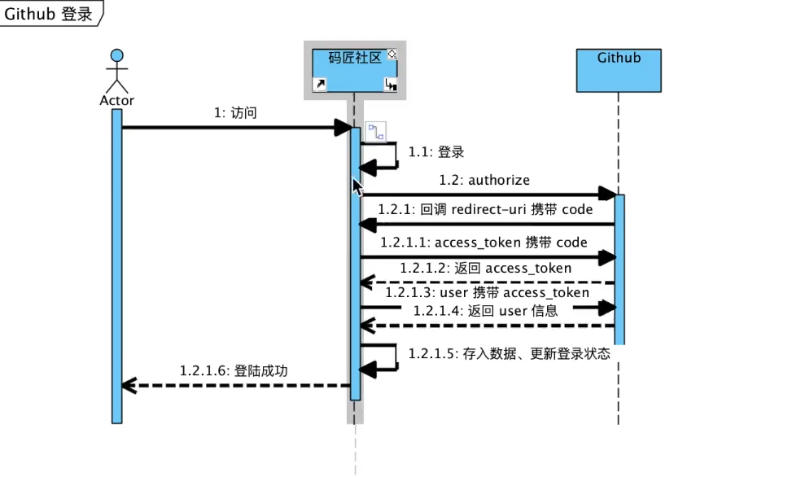

## 牛柳社区

## 资料
[对标模板](https://elasticsearch.cn/)

[Spring官网指南](https://spring.io/guides/)

[前端框架BootStrap---中文官网](https://www.bootcss.com/)

[github OAuth Documents(登录授权文档)](https://developer.github.com/apps/building-oauth-apps/creating-an-oauth-app/)

 

[OkHttp接口调用文档](https://square.github.io/okhttp/)

获取github传过来的用户登录信息，调试网址
https://api.github.com/user?access_token=81a3f2e494538d132d1f486443762355fe7cf7e0